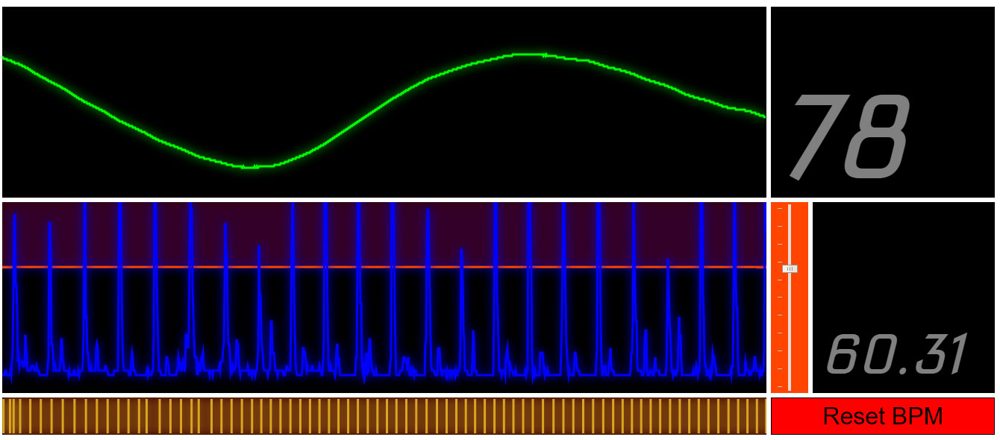

# BPM Heart Rate Monitor
A quick and easy heart rate BPM monitor using HTML5 Audio

## A working demo of the BPM Heart Rate Monitor

https://sean-bradley.github.io/BPMHeartRateMonitor/  (Best viewed using Google CHROME)

## A screen grab of the BPM Heart Rate Monitor

## Tutorial on how to build a cheap electronic stethoscope
You should use an electronic stethoscope plugged into your pc to use this BPM heart monitor properly.

I have created a tutorial which shows you how to do this using cheap parts you can buy online.

 

[Build a cheap electronic stethoscope](https://youtu.be/FVUFy_aSpOc)

Enjoy
